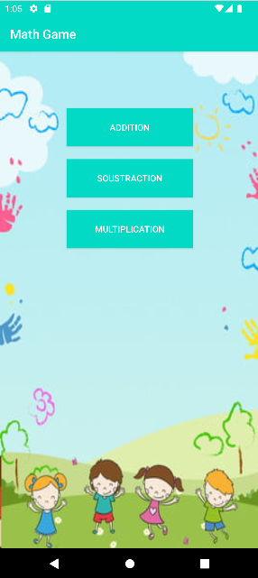
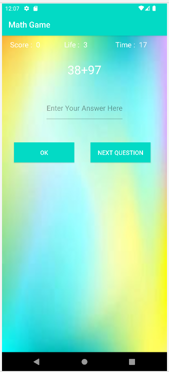
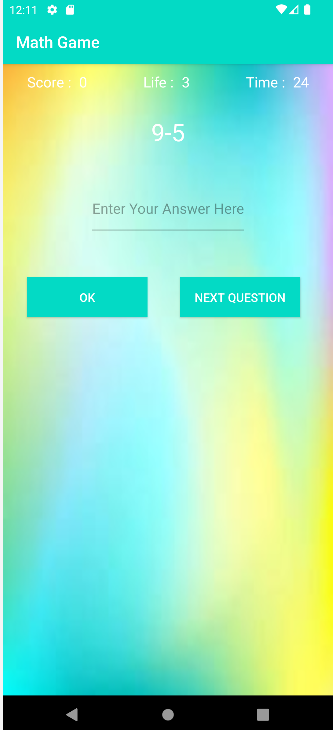
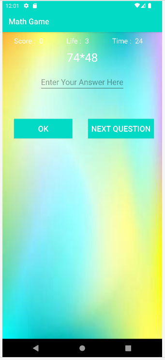
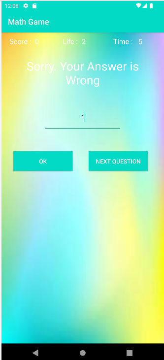
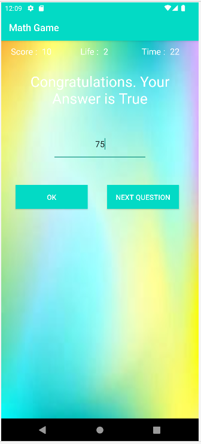
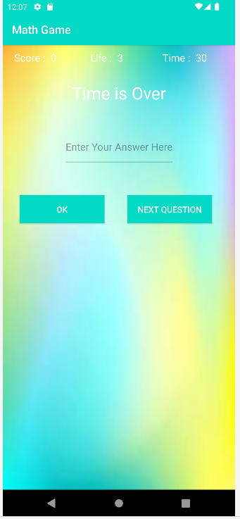

# MathGame
MathGame is an Android application designed to help users, especially children, improve their arithmetic skills through engaging and interactive gameplay. The app presents various math problems and tracks the player's progress over time.
## Features
- Basic Arithmetic Problems: Includes exercises for addition, subtraction, multiplication, and division.
- Multiple Difficulty Levels: Offers various levels to adjust the difficulty of the problems based on the player's proficiency.
- Progress Tracking: Monitors and records the player's performance to provide feedback and encouragement.
- User-Friendly Interface: A clean and intuitive interface designed for ease of use by children.
- Interactive Gameplay: Engaging game mechanics to make learning math fun and effective.
## Screenshots

  

 
 
 
 

## Getting Started
### Prerequisites
To run MathGame on your Android device, you need the following:
- An Android device running Android 5.0 (Lollipop) or higher.
- Android Studio installed on your development machine.
### Installation
1. Clone the repository:
   ~~~
   git clone https://github.com/HACHEM98/MathGame.git
   ~~~
2. Open the project in Android Studio:
   ~~~
   cd MathGame
   ~~~
3. Build the project in Android Studio:
   - Open Android Studio.
   - Select Open an existing project.
   - Navigate to the MathGame directory and open it.
   - Let Android Studio build the project. This may take a few minutes.
4. Run the app on an emulator or physical device:
   - Connect your Android device via USB or set up an emulator.
   - Click the Run button in Android Studio.
## Usage
Upon launching the app, you will be greeted with a home screen where you can select the type of math problems (addition, subtraction, multiplication, or division) and the difficulty level. Once a game mode is selected, the app will present math problems for you to solve. Your progress and scores will be tracked and displayed.
## Contributing
1. Fork the repository.
2. Create a new branch:
   ~~~
   git checkout -b feature-name
   ~~~
3. Make your changes and commit them:
   ~~~
   git commit -m 'Add new feature'
   ~~~
4. Push to the branch:
   ~~~
   git push origin feature-name
   ~~~
5. Create a new Pull Request.
## License
 This project is licensed under the MIT License. See the LICENSE file for details.
## Contact
Email-hachemslimene31@gmail.com
